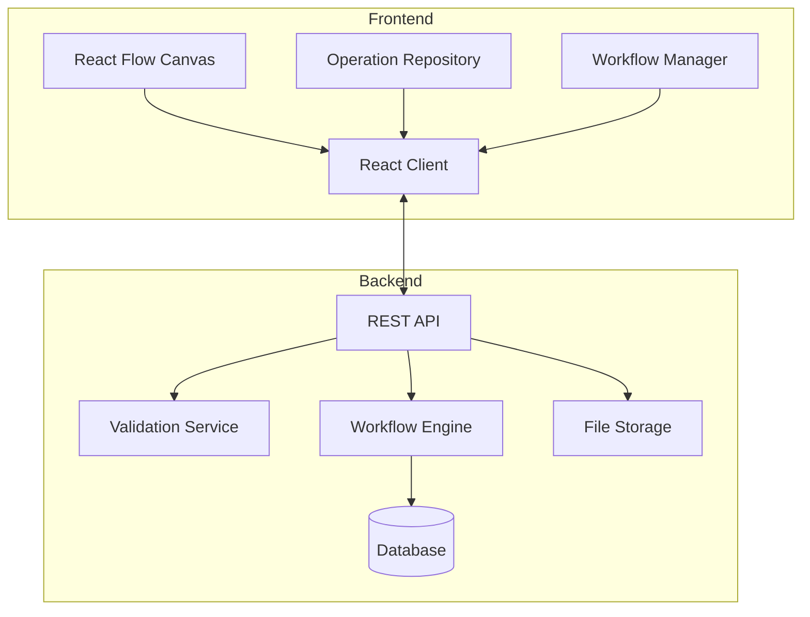

从文档中总结的关键需求：

1. 核心功能：
- 可视化工作流管理器，基于React Flow实现
- 用户可从预定义的单元操作(Unit Operations)库中拖拽组件到画布
- 支持工作流分支
- 每个操作节点可以有交互功能(如文件上传按钮)
- 工作流需要可以保存和复现

2. 单元操作特点：
- 支持多种实验室操作(如96孔板转移、文件上传等)
- 节点可以有单/多输入输出
- 需要验证规则(必选/可选输入)
- 可扩展性(支持连接不同仪器设备)

系统架构设计：

主要模块职责：

1. Frontend:
- React Flow Canvas: 工作流编辑器核心
- Operation Repository: 管理预定义操作组件
- Workflow Manager: 处理工作流的保存/加载/验证

2. Backend:
- REST API: 提供统一接口
- Validation Service: 处理节点间连接验证
- Workflow Engine: 工作流执行引擎
- Database: 存储工作流定义和执行记录
- File Storage: 处理文件上传

建议实现步骤：
1. 搭建基础React Flow画布
2. 实现简单的拖拽功能和3-4个基础操作组件
3. 添加节点间连接验证
4. 实现工作流保存/加载
5. 开发文件上传等交互功能

src/
  components/
    Flow/
    OperationNodes/
    Sidebar/
  hooks/
  services/
  types/
  App.tsx
  index.tsx