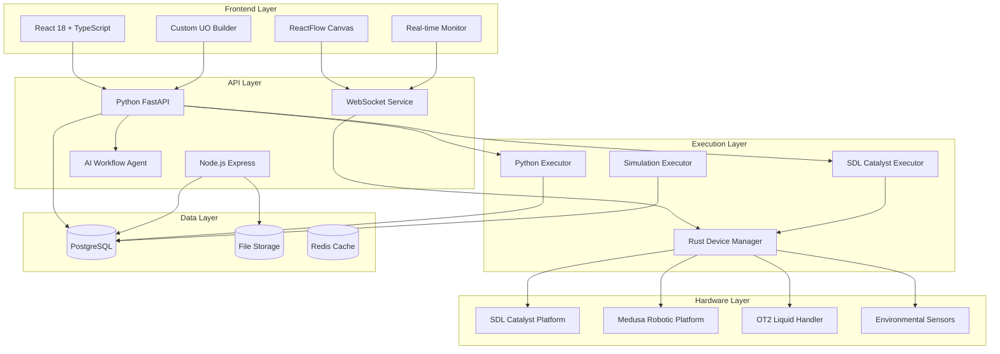
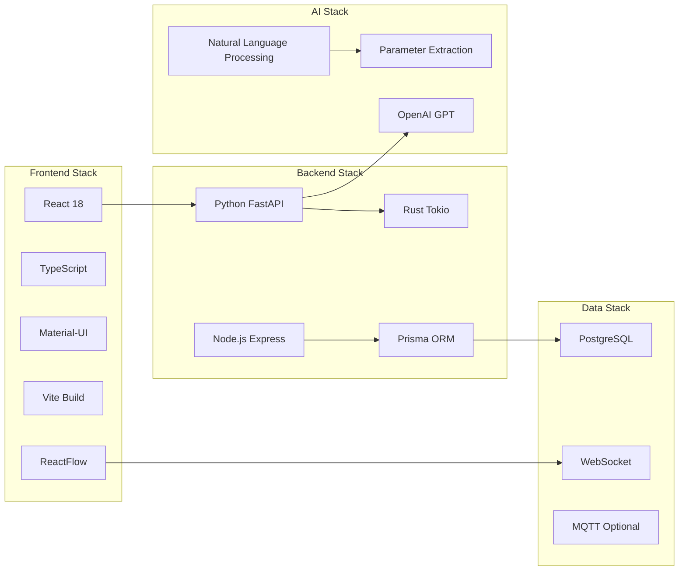
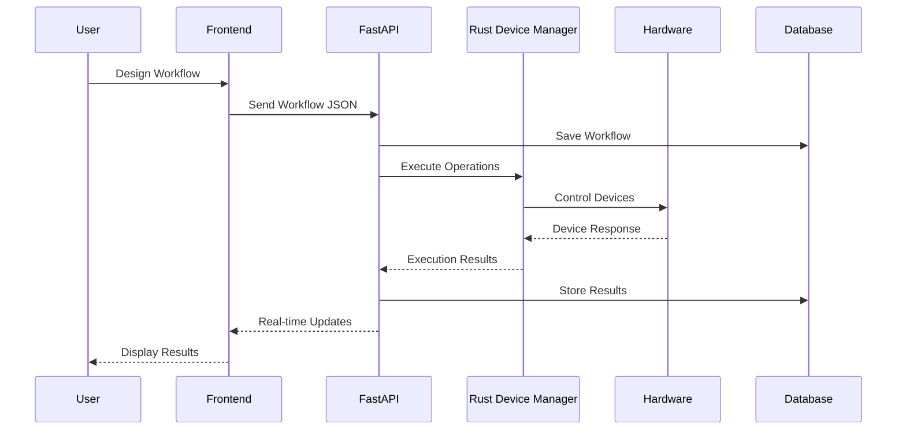
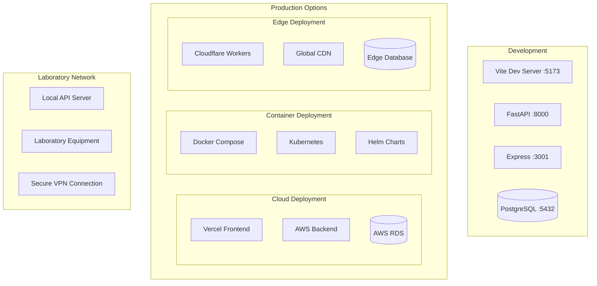
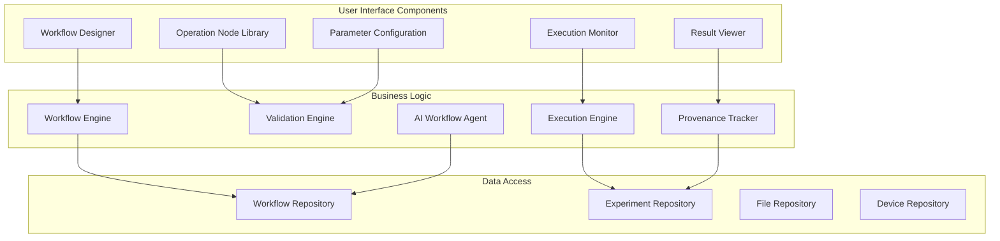
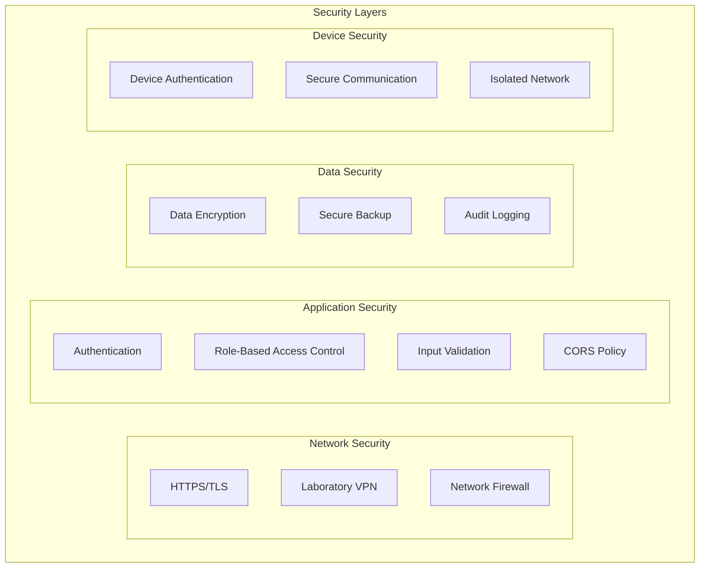
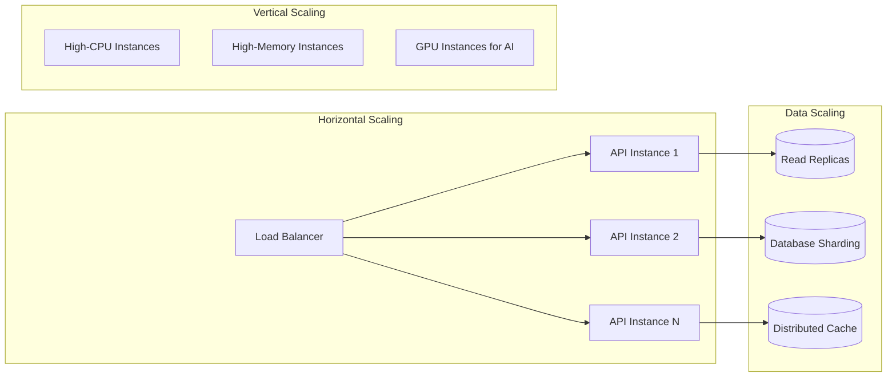

# System Architecture Diagram

## High-Level Architecture Overview

## Technology Stack Flow

## Data Flow Architecture

## Deployment Architecture

## Component Interaction Map

## Security Architecture

## Scalability Architecture

This architecture supports:
- **Scalable execution** for multiple concurrent experiments
- **Real-time monitoring** of laboratory operations
- **Fault tolerance** with graceful degradation
- **Scientific reproducibility** through complete provenance tracking
- **Multi-tenant support** for shared laboratory resources